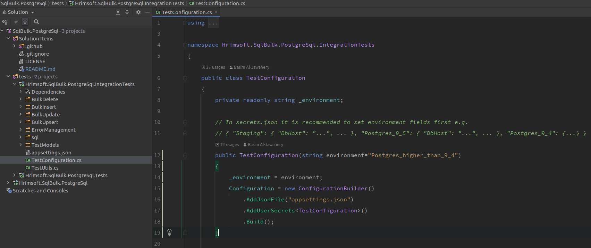

# Postgresql Bulk Service #


PostgreSqlBulkService is a library for efficient bulk operations (insert, update, upsert, and delete) to PostgreSQL databases.

## Installing ##

To install [NuGet package PostgreSqlBulkService](https://www.nuget.org/packages/Hrimsoft.PostgreSqlBulkService), run the following command in the Package Manager Console:

```
PM> Install-Package Hrimsoft.PostgreSqlBulkService
```
## Documentation ##
- [Basic Usage](docs/basic-usage.md)
- [Mapping entities to database tables](docs/mapping.md)
- [Error Handling](docs/error-handling.md)
- [Update entity properties after executing bulk operations](docs/returning-clause.md)
- [Upsert: Insert and update in one request](docs/upsert-usage.md)

## Setup Integration Tests

In a nutshell, 
- [ ] install postgres database
- [ ] run sql scripts on it that would create tables and required constraints.
- [ ] set the environment
- [ ] run integration tests

### Install postgres database
As upsert command supported in postgres only from 9.5 and higher versions we need to install it:
It's better to extract db data from docker container with volumes, so when recreating a docker container you will not be required to run sql scripts again.
```
docker run -d --name db-bulk-tests -p 8765:5432 \
       -e POSTGRES_PASSWORD=Q_w_E_r_T_y \
       -v /db/sql-bulk-service-postgresql/:/var/lib/postgresql/data \
       postgres:alpine
```
If the data volume you're using is a filesystem mountpoint (like with GCE persistent disks) or remote folder that cannot be chowned to the postgres user (like some NFS mounts), Postgres initdb recommends a subdirectory be created to contain the data.
```
docker run -d --name db-bulk-tests -p 8765:5432 \
       -e POSTGRES_PASSWORD=Q_w_E_r_T_y \
       -e PGDATA=/var/lib/postgresql/data/pgdata \
       -v /db/sql-bulk-service-postgresql/:/var/lib/postgresql/data \
       postgres:alpine
```
I mapped db port on 8765 just for example, if you don't have another installed postgres on your host, you can keep the standard port 5432, so it'll be 5432:5432
### Run sql scripts
There are sql scripts in folder Hrimsoft.SqlBulk.PostgreSql.IntegrationTests/sql that must be run on a created database. 

### Set the environment
I recommend use user secrets for setting information about the host, port, username and password of database that is used for integration tests.

In the Hrimsoft.SqlBulk.PostgreSql.IntegrationTests.csproj file there is UserSecretsId section where the project UUID is set.
and in the constructor of TestConfiguration class, where appsettings is loading, you can find this line of code:
```c#
.AddUserSecrets<TestConfiguration>()
```

In Rider there is a plugin '.Net Core User Secrets' that could manage secret.json file. For that you should open a context menu on a project and select "Tools" > "open project user secrets".

In Visual Studio on the project context menu select "Manage User Secrets".

In secret.json file put 

```json
{
  "Postgres_higher_than_9_4": {
    "Database": "postgres",
    "DbUsername": "postgres",
    "DbPassword": "Q_w_E_r_T_y",
    "DbHost": "localhost",
    "DbPort": "8765"
  },
  "Postgres_9_4": {
    "Database": "postgres",
    "DbUsername": "postgres",
    "DbPassword": "12345-Zx",
    "DbHost": "192.168.0.14",
    "DbPort": "5432"
  }
}
```

Name of settings that have to be used is passed to TestConfiguration constructor and by default is 'Postgres_higher_than_9_4'



## License

PostgreSqlBulkService is licensed under the MIT License. See [LICENSE](LICENSE) for details.

Copyright (c) Basim Al-Jawahery
